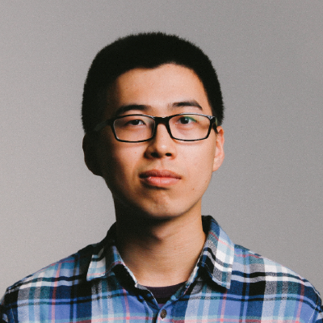

<h1>Honghua Dong (董宏华) </h1>

Email: dhh19951@gmail.com, honghuad@cs.toronto.edu

## About Me
I am currently a Ph.D. student at University of Toronto, adviced by Prof. [Xujie Si](https://www.cs.toronto.edu/~six/), Prof. [Chris J. Maddison](https://www.cs.toronto.edu/~cmaddis/) and Prof. [Jimmy Ba](https://jimmylba.github.io/). I have graduated from [IIIS, Tsinghua University](http://iiis.tsinghua.edu.cn/en) (*YaoClass*) in 2019, major in computer science.

## Research Interests
My current research interest is in developing Language Model Agents.

I am broadly interested in artificial intelligence and have also worked on various topics including Reasoning, Graph Neural Networks, Reinforcement Learning and Computer Vision.

<!-- import selected projects -->
--8<-- "selected_projects.md"

[See a full list](all_pubs.md)

## Experiences
- I have won Gold Medal in The 26th International Olympiad in Informatics ([IOI2014](https://stats.ioinformatics.org/results/2014)).
- I have participated in [ACM-ICPC 2016 World Finals](https://cphof.org/standings/icpc/2016) as a team member.
- I have interned in [Megvii Inc. (Face++)](https://megvii.com/), [Google China AI Center](https://www.blog.google/around-the-globe/google-asia/google-ai-china-center/), Google (Beijing) and Tencent Inc. I am currently a research intern at [Sierra](https://sierra.ai/).
- I have visited University of Southern California (adviced by [Joseph Lim]("http://www-bcf.usc.edu/~limjj/")), University of California, Berkeley (adviced by [Stuart Russell](https://people.eecs.berkeley.edu/~russell/)) and University of Toronto (adviced by [Jimmy Ba](https://jimmylba.github.io/)).

## Services
- I have served as a reviewer for conferences including NeurIPS, ICLR and ICML.

## Misc
Last updated Sept 2024.
